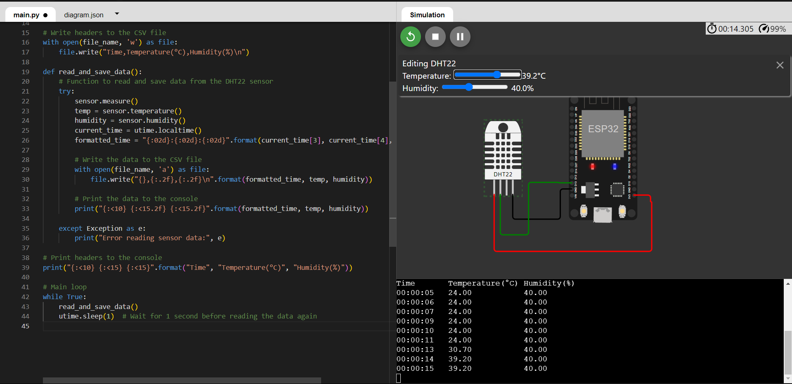

*for hackathon purposes 

what this repo basically does :

extract the temperature and humidity from the soil -> stores it into a csv file -> real time monitoring of the data which means if the temperature or the humidity crosses the threshold the user is immediately sent notification for the same -> makes a dashboard out of the csv file 

